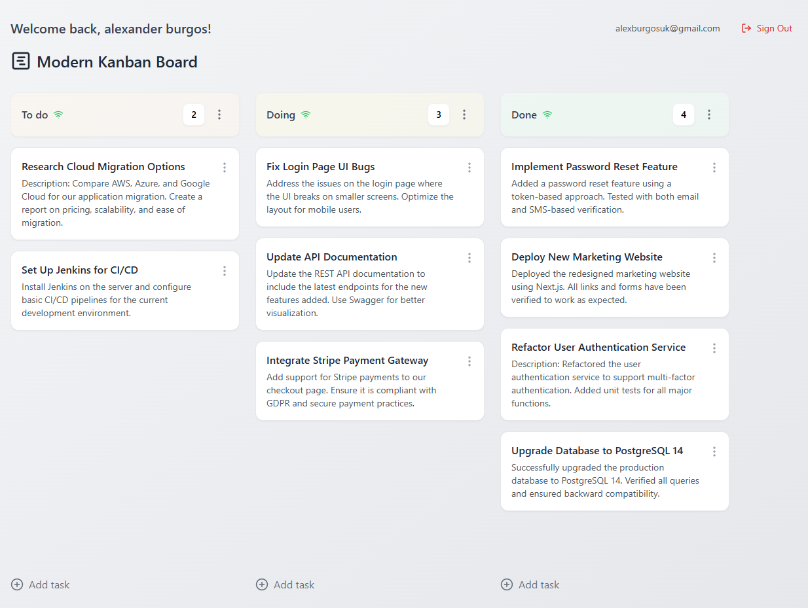

# Kanban Board Application

Welcome to the **Kanban Board Application**! This project is a highly flexible and customizable board designed to help users manage their tasks effectively. Each user has their own Kanban board, allowing them to create, organize, and modify tasks and columns as per their needs.

## Features

- **User-Specific Boards**: Each user gets a personalized Kanban board after signing up, providing a unique workspace to manage tasks.
- **Third-Party Authentication**: Sign up and log in with **GitHub** or **Google** accounts for seamless access.
- **Highly Customizable Columns**: Users can create, rename, move, and delete columns to better organize their tasks.
- **Task Management**: Add new tasks, edit task details, assign priorities, and delete tasks. Tasks can also be moved between columns easily using drag-and-drop functionality.
- **Responsive Design**: The application is built with a responsive layout, ensuring optimal usability across different devices.
- **Network Status Check**: The application keeps track of the user's network status to ensure all actions are properly handled in case of disconnection.

## Technologies Used

- **React.js**: For building the user interface.
- **TypeScript**: Strong typing for better code maintainability.
- **Firebase Authentication**: To allow easy sign-up and login using GitHub or Google accounts.
- **CSS (TailwindCSS)**: For styling and ensuring a clean, modern, and responsive UI.

## Installation and Setup

1. Clone the repository:
   ```bash
   git clone https://github.com/yourusername/kanban-board.git
   ```
2. Navigate to the project directory:
   ```bash
   cd kanban-board
   ```
3. Install the dependencies:
   ```bash
   npm install
   ```
4. Create a `.env` file in the root directory to store environment variables for **Firebase** configuration.
5. Start the application:
   ```bash
   npm start
   ```

## Directory Structure

The project is structured as follows:

```
kanban-board/
  ├── dist/
  ├── node_modules/
  ├── public/
  ├── src/
      ├── components/
          ├── AuthGuard.tsx
          ├── Column.tsx
          ├── ColumnMenu.tsx
          ├── CreateColumnModal.tsx
          ├── CreateTaskModal.tsx
          ├── DeleteModal.tsx
          ├── DeleteTaskModal.tsx
          ├── EditTaskModal.tsx
          ├── LoginPage.tsx
          ├── NetworkStatus.tsx
          ├── TaskCard.tsx
          ├── TaskContextMenu.tsx
          ├── TaskForm.tsx
```

### Components Overview

- **AuthGuard.tsx**: Protects routes and ensures users are authenticated.
- **Column.tsx**: Represents a column in the Kanban board, containing tasks.
- **ColumnMenu.tsx**: Dropdown menu for column-related actions (edit, delete, etc.).
- **CreateColumnModal.tsx**: Modal component for creating new columns.
- **CreateTaskModal.tsx**: Modal component for adding a new task.
- **DeleteModal.tsx**: Generic modal for confirming deletions.
- **DeleteTaskModal.tsx**: Modal for confirming task deletion.
- **EditTaskModal.tsx**: Modal for editing an existing task.
- **LoginPage.tsx**: Handles user login, including GitHub and Google sign-ins.
- **NetworkStatus.tsx**: Displays the network connection status.
- **TaskCard.tsx**: Represents an individual task card.
- **TaskContextMenu.tsx**: Context menu for task-specific actions.
- **TaskForm.tsx**: Form component used for both creating and editing tasks.

## Usage

1. **Sign Up/Login**: Use the login page to sign up using GitHub or Google. Once logged in, your personal Kanban board is generated.
2. **Manage Columns**: Add new columns, rename or delete columns, and rearrange them as needed.
3. **Add Tasks**: Click on **Add Task** at the bottom of each column to create a new task. Use the task menu to edit or delete tasks.
4. **Prioritize and Organize**: Assign priorities to tasks and move them between columns by dragging and dropping.

## Contributions

Contributions are welcome! Please open an issue first to discuss what you would like to change. Pull requests are always welcome.

## License

This project is licensed under the MIT License.

## Screenshots



## Contact

For more information or questions, please feel free to reach out at: [alexanderburgosuk82@gmail.com](mailto:alexanderburgosuk82@gmail.com).

### Connect with Me

- **YouTube**: [UX/UI Conexión Creativa](https://www.youtube.com/@uxuiconexioncreativa/videos)
- **LinkedIn**: [Alexander's Studio](https://www.linkedin.com/in/alexandersstudio/)

---

Enjoy your productivity boost with our Kanban Board Application! 🎉
